# Kermite 導入方法

このページでは、Kermiteを使ってキーボードの配列を変更できるようにする方法を解説します。

例としてT.Shinohara氏の<a href="https://booth.pm/ja/items/1444895" target='_blank'>shiro</a>に対応ファームウェアを書き込んで、Kermite上で使えるようにしてみます。

## 起動

Kermiteを起動するとこのような画面になります。

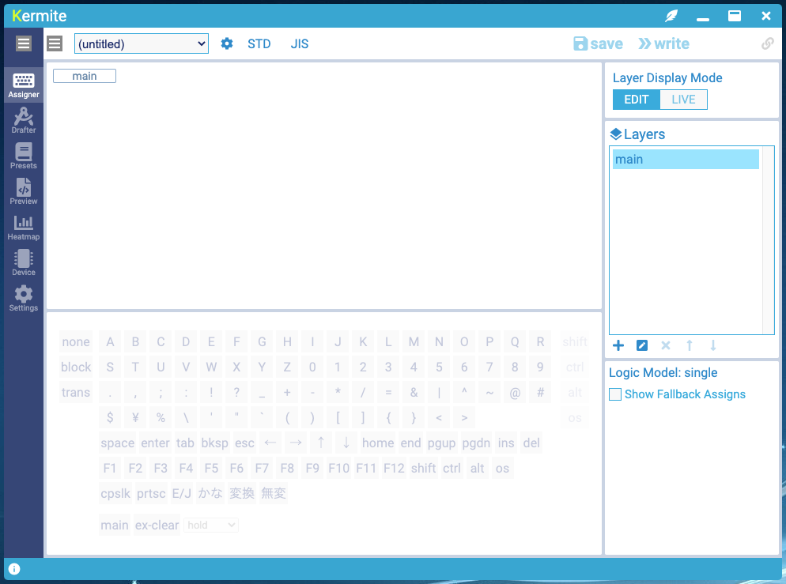

## 日本語の表示に変更

初期状態では英語のUIが表示されます。このドキュメントでは日本語の表示にして解説を行います。

画面左上のグローバルメニューで`Japanese`を選ぶと、日本語表示に切替わります。

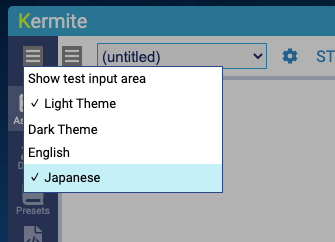


## ファームウェアの書き込み

キーボードに対応ファームウェアを書き込みます。

ファームウェアはキーボードの品種ごとに対応が必要で、事前にKermiteのリポジトリに取り込まれている必要があります。

サイドバーで、


をクリックしてデバイス管理画面に移動します。

デバイス管理画面には、接続するデバイスの選択、接続中のデバイスの情報の表示、カスタムパラメータの設定、ファームウェアの書き込みのUIがあります。

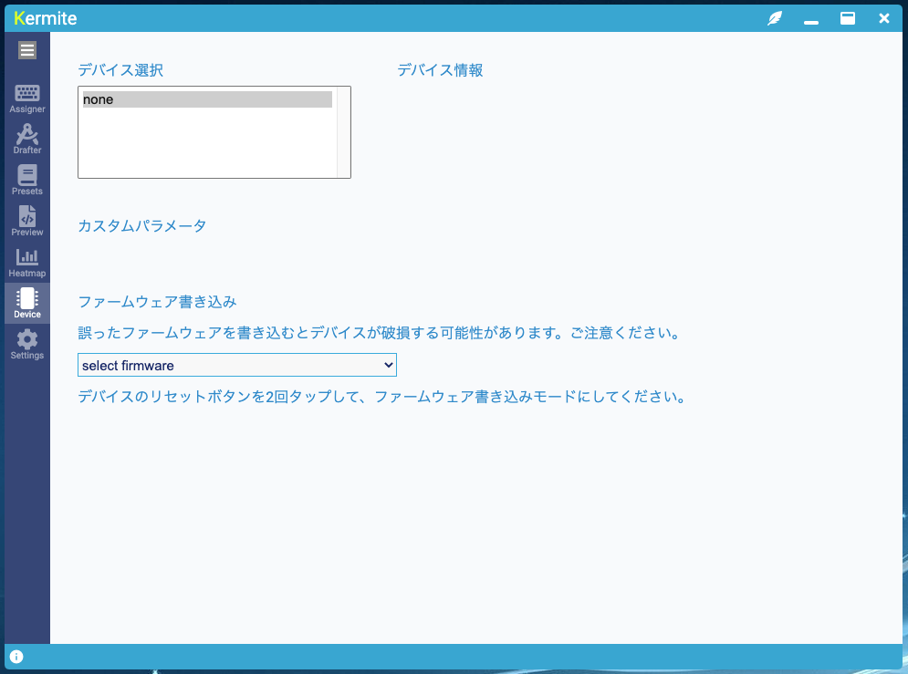

ファームウェア書き込みのセクションで、書き込むファームウェアを選びます。

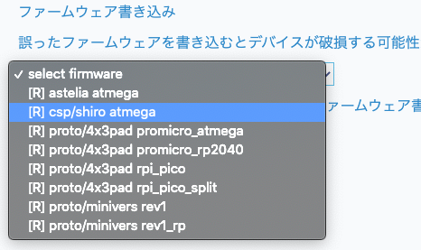

ここでは
```
[R] csp/shiro atmega
```
を選びます。

キーボードのリセットボタンを2回押して書き込みモードにします。

仮想COMポートが検出され、書き込み可能な状態になりました。

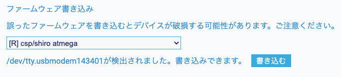

`書き込む`ボタンを押します。

書き込みに成功するとこのような表示になります。

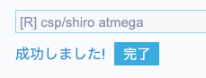

キーボードがKermite対応デバイスになり、デバイス選択欄に表示されるようになりました。選択して接続します。

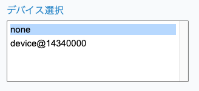

接続がうまくいくと、デバイス情報やカスタムパラメータの設定UIが表示されます。

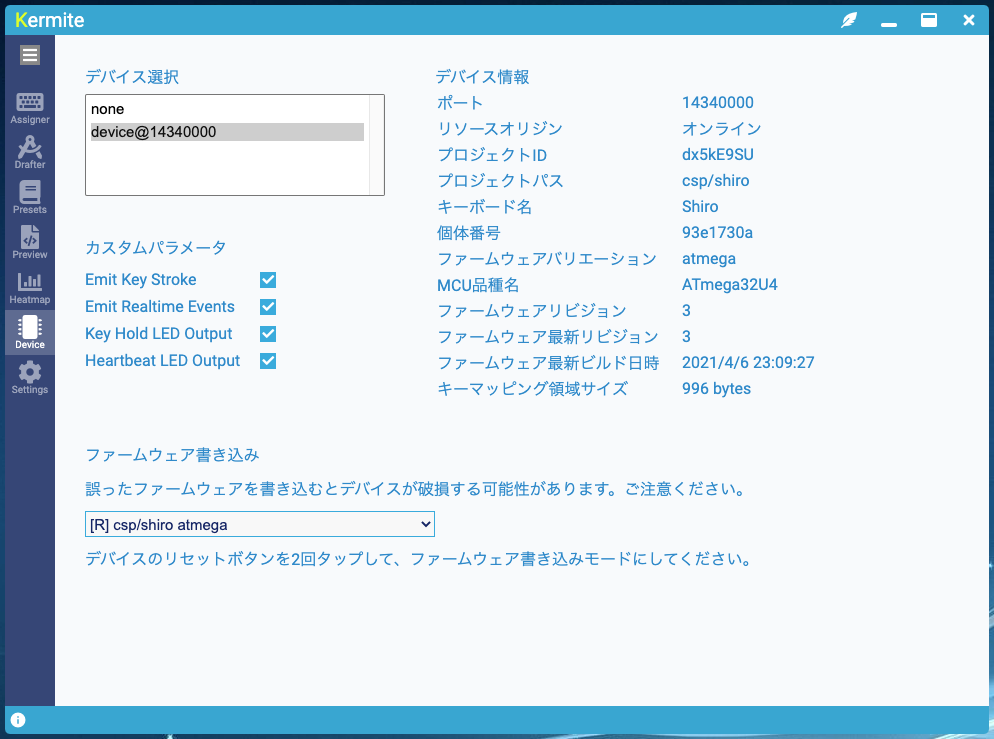

## プロファイルの作成

Kermiteでは、キーボードの配列設定をプロファイルと呼んでいます。
ここではプリセットを元に、新しいプロファイルを作成します。

サイドバーで、


をクリックしてプリセットブラウザに移動します。

プリセットブラウザでは、登録されているキーボードのプリセットの閲覧や取り込みができます。

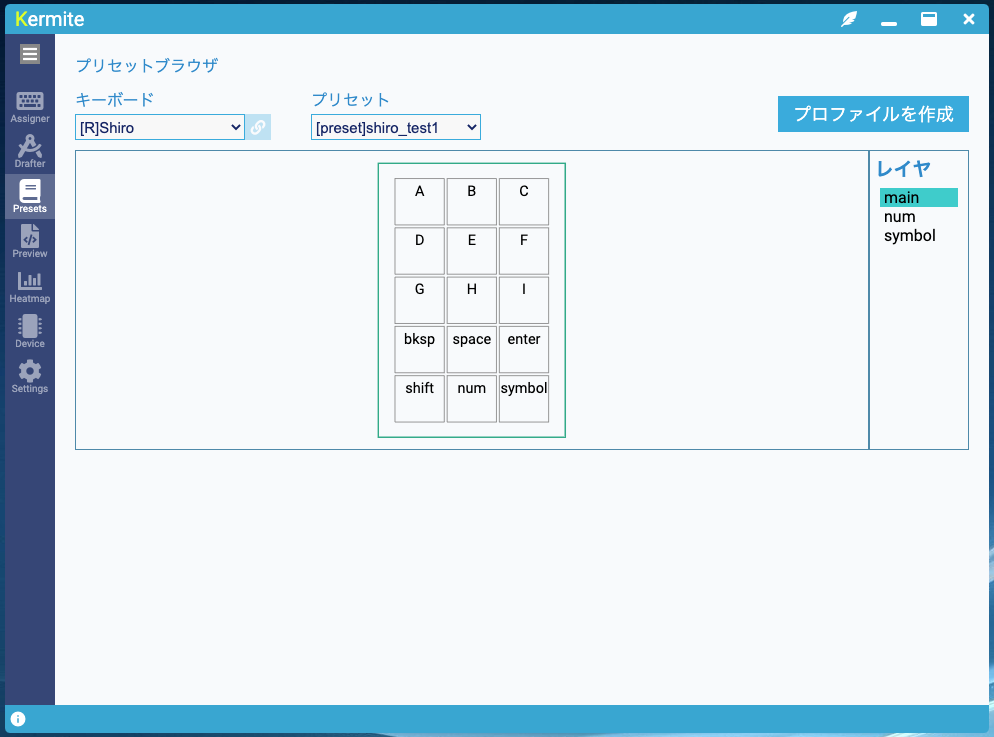

キーボードの品種とプロファイルを選びます。
ここでは、キーボードは
```
[R]Shiro
```
プリセットは
```
[R]shiro_test1
```
を選びます。

`プロファイルを作成`ボタンを押して、このプリセットを元に新しいプロファイルを作成します。


キーマッピング編集画面に自動で遷移します。新しいプロファイルが未保存の状態で作成されています。

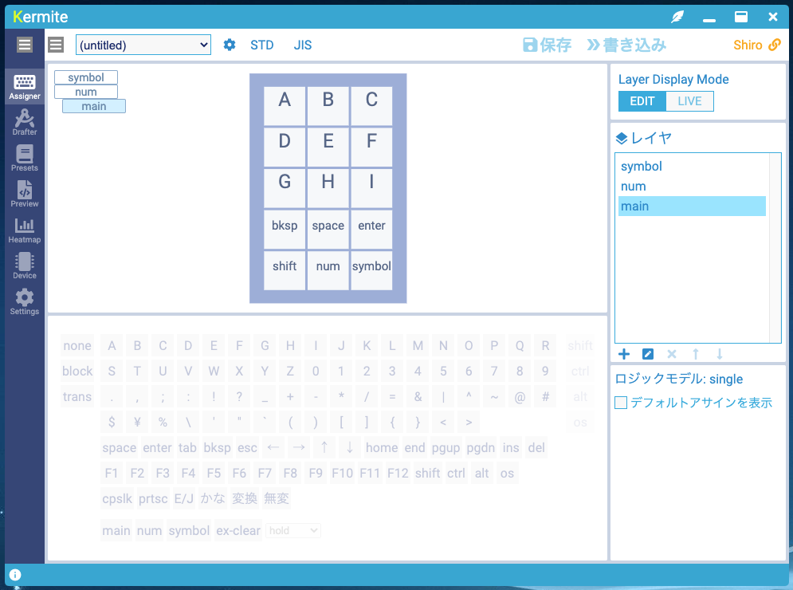

メニューから`保存`を選びます。

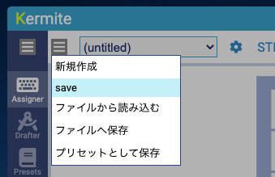

プロファイルの名前を指定するダイアログが出ます。適当な名前をつけてOKボタンを押します。

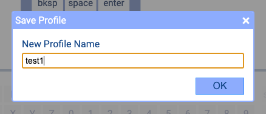

プロファイルが保存されました。保存されているプロファイルはセレクタで名前を選んで切り替えられるようになります。


## キーマッピングの書き込み

キーボードにキーマッピングを書き込みます。

デバイスにキーマッピングを書き込む前に、キーボードレイアウト(US/JIS)を指定します。OSの設定に合わせる必要があります。


`書き込み`ボタンを押して、キーボードにキーマッピングを書き込みます。


書き込みが成功すると、ダイアログが表示されます。

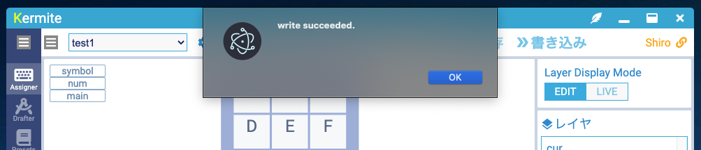


## 文字入力の動作確認

文字入力の動作を確認します。

テキストエディタなどを開いて文字が入力されることを確認します。
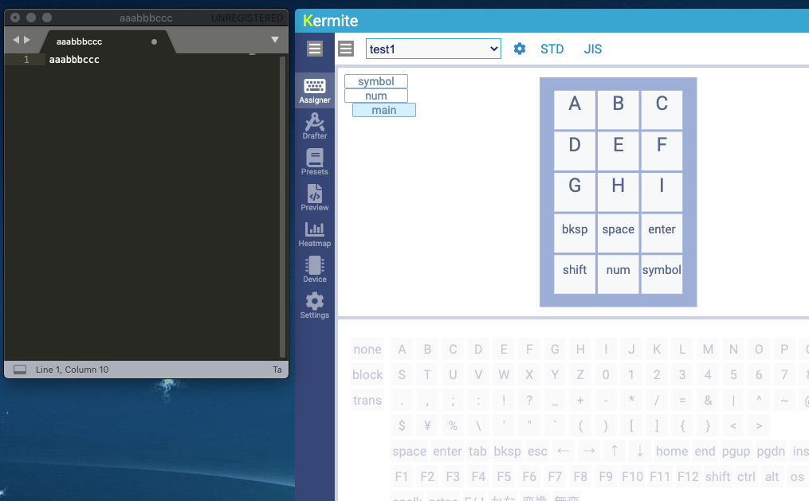

また、アプリ内部にもテスト用の文字入力欄があり、文字入力の確認に使えます。メニューから有効化すると表示されます。

 <br />

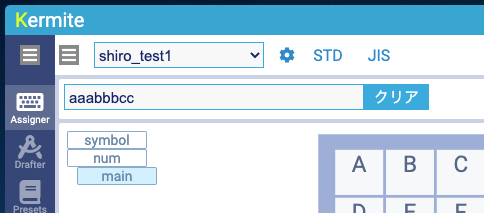

## レイヤ表示の動作確認

Kermiteでは、接続しているキーボードのキーの押下状態が画面に表示されます。また、接続されているキーボードの実際のレイヤ状態を反映して表示するモードがあります。それらの動作を確認します。

キーボードのキーを押すと押したキーが画面上の表示に反映されます。


レイヤのリアルタイム表示の動作を確認します。

右上にレイヤ表示モードの切り替えUIがあります。


- `EDIT` では編集用に選択しているレイヤが表示されます。
- `LIVE` では接続しているキーボードの実際のレイヤ状態を反映して表示します。

ここではレイヤ表示モードを`LIVE`にします。

キーボードのレイヤキーを押したときに表示が切り替わるようになります。


## キーマッピングの変更

キーマッピングを変更します。

キーボード表示でキーアサインを変更したいキーを選び、下のパレットで割り当てる機能を指定します。


変更したら書き込みを行い、デバイスに反映されていることを確認します。


## ウィジェット表示

画面右上の


を押すとウインドウ枠のないウィジェット表示になります。

デスクトップの端に置いてレイヤ状態の確認などに使用できます。


## キー配置の変更

Kermiteには、キーの配置をGUIで編集できるレイアウトエディタが内蔵されています。

レイアウトエディタでは、
* 新規レイアウトの作成
* 既存レイアウトの編集
* プロファイルが内部で保持しているレイアウトの変更

ができます。

ここでは、現在編集しているプロファイルのキーレイアウトにキーを追加する変更を行ってみます。
(実デバイスの構成はそのままなので効果は特にありません)

メニューから


を選んで、レイアウト編集画面に移動します。


画面左上の


を押すと、現在選択されているプロファイルのレイアウトが編集対象になります。


キーや外形を変更します。`add`ボタン,`move`ボタンで編集モードを選んで、マウス操作や数値入力でキーや外形の変更を行います。


ここでは、
* キーを3つ追加
* 外形を変更
* キーにkeyIndexを指定

を行いました。

画面右上の`save`ボタンを押して保存すると、プロファイルに反映されます。


## まとめ

お疲れさまでした。このドキュメントではKermiteを使ってキーボードの運用が最低限できるように解説を行いました。細かな機能についてはいろいろ試しながら使ってみてください。

## TIPS(開発者向け)

設定画面でKermiteのソースコードの場所を指定すると、Kermiteのソースコードの配下にあるプロジェクトのリソースを利用できるようになります。開発やデバッグの際に使用します。以下の機能が有効になります。

* プリセットブラウザでローカルにあるプロジェクトが持つプロファイルが列挙されるようになります。
* レイアウト編集画面のメニューでローカルのプロジェクトのレイアウトファイルを読み込み/保存できるようになります。
* デバイス管理画面でローカルでビルドしたファームウェアを書き込みできるようになります。

プロジェクトを選択する際のセレクタで`[L]`はローカル,`[R]`はリモート(オンライン)のリソースを表しています。

