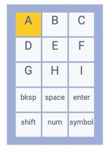
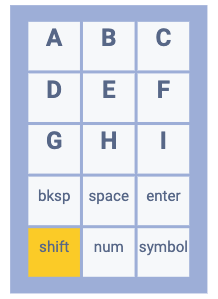
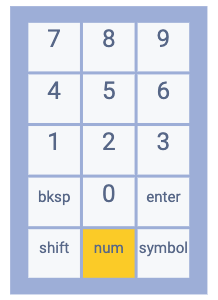
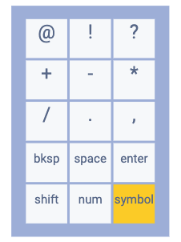
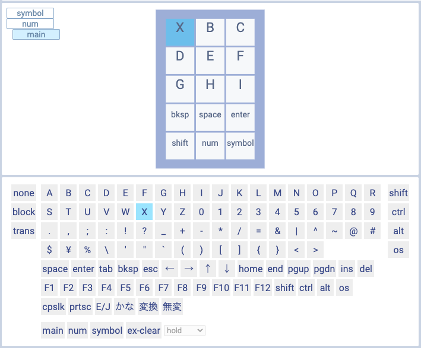
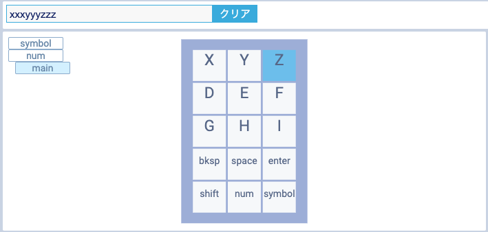
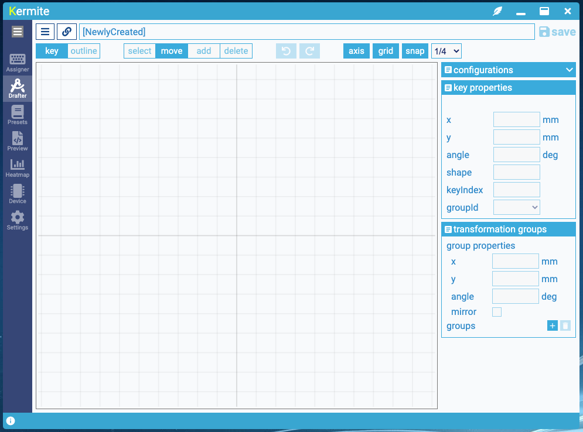
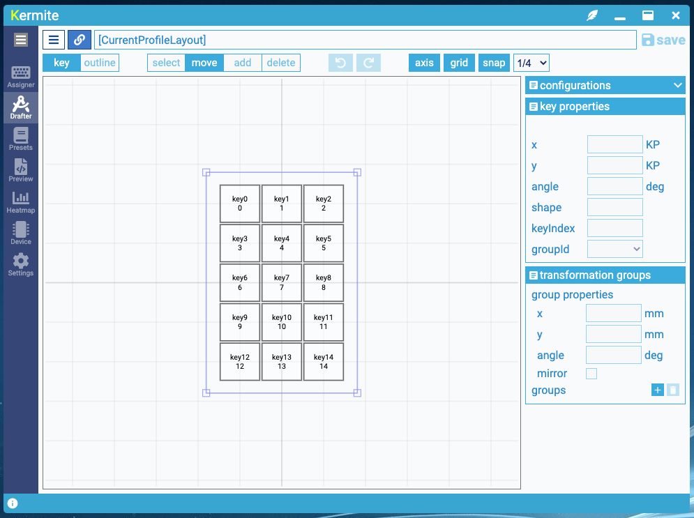
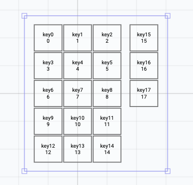
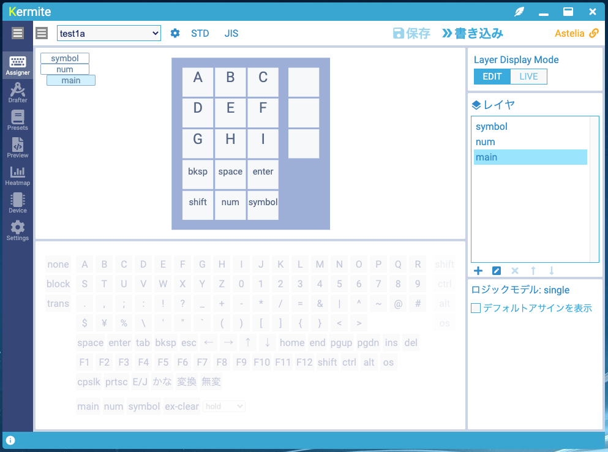

# Kermite 導入方法


※ 2022/06 このドキュメントは古くなっており、現在の実装とは互換性がありません。参考のために残してあります。現在はソフトがブラウザ上で動作するようになっており、デスクトップ版は提供していません。また対応MCUがRP2040のみとなっています。

このページでは、Kermiteを使ってキーボードを運用する方法を解説します。

例としてT.Shinohara氏の<a href="https://booth.pm/ja/items/1444895" target='_blank'>Shiro</a>に対応ファームウェアを書き込んで、Kermite上で使えるようにしてみます。

(この解説でShiroを使用することについて、Shinohara氏の承諾を得ています。Kermiteを使用することで問題が出た場合は、Shinohara氏ではなくyahiroに相談してください。)
## 目次
- インストール
- 起動
- 日本語表示の設定
- ファームウェアの書き込み
- プロファイルの作成
- キーマッピングの書き込み
- 文字入力の動作確認
- レイヤの動作確認
- リアルタイム表示の動作確認
- ウィジェット表示
- まとめ
- Tips(開発者向け)

## インストール

[リリースページ](https://github.com/kermite-org/Kermite/releases)からインストーラをダウンロードしてインストールしてください。

以下では署名がないために出るOSの保護機能を抑止しています。

<details><summary>コード署名についての詳細</summary><div>
WindowsやMacOSは、コード署名によってアプリが改ざんされていないことを証明することを推奨しています。コード署名には費用がかかるため、小規模なOSSなど非営利で開発しているソフトウェアでは適用するのが難しいです。
Kermiteではソースコードやビルド過程を公開しており、それによって配布されるプログラムの透明性を保っています。
</div></details>

### Windows
 インストーラを実行しようとすると'WindowsによってPCが保護されました'というダイアログが出ます。
 
<div style="display:flex; gap:5px">


</div>

 '詳細情報'をクリックして、'実行'ボタンを押します。

 インストーラの手順に沿ってインストールします。

### MacOS
 そのまま実行すると'開発元が未確認のため開けません'というダイアログが出ます。

<div style="display:flex; gap:5px; align-items:center">


</div>

 アプリのアイコンを右クリックしたときに出るメニューから'開く'を選ぶと実行するかどうかを確認するダイアログが出るので、そこから実行します。

 インストーラの手順に沿ってインストールします。
 


## 起動

Kermiteを起動するとこのような画面になります。


## 日本語の表示に変更

初期状態では英語のUIが表示されます。このドキュメントでは日本語の表示で解説を行います。


画面左上のグローバルメニューで`Japanese`を選ぶと、日本語の表示に切替わります。

## ファームウェアの書き込み

キーボードに対応ファームウェアを書き込みます。

ファームウェアはキーボードの品種ごとに対応が必要で、事前にKermiteのリポジトリに取り込まれている必要があります。

サイドバーで、


をクリックしてデバイス管理画面に移動します。


デバイス管理画面には、デバイスの選択、デバイス情報の表示、パラメータの設定、ファームウェア書き込みのUIがあります。


ファームウェア書き込みのセクションで、書き込むファームウェアを選びます。
ここでは
```
Shiro (shiro atmega)
```
を選びます。

キーボードのリセットボタンを2回押して書き込みモードにします。


仮想COMポートが検出され、書き込み可能な状態になりました。
`書き込む`ボタンを押します。


書き込みに成功するとこのような表示になります。


キーボードがKermiteの対応デバイスになり、デバイス選択欄に表示されるようになりました。選択して接続します。


接続がうまくいくと、デバイス情報やパラメータの設定UIが表示されます。
## プロファイルの作成

Kermiteでは、キーボードの配列設定をプロファイルと呼んでいます。
ここでは規定のレイアウトを元に、新しいプロファイルを作成します。

サイドバーで、


をクリックしてプリセットブラウザに移動します。

プリセットブラウザでは、登録されているキーボードのプリセットを閲覧したり、取り込むことができます。


キーボードの品種とプリセットを選びます。
ここでは、キーボードは
```
Shiro (shiro)
```
プリセットは
```
[blank]default
```
を選び、空のプリセットを読み込みます。

`プロファイルを作成`ボタンを押して、このプリセットを元に新しいプロファイルを作成します。


キーマッピング編集画面に自動で遷移します。
新しいプロファイルが未保存の状態で作成されています。


メニューから`保存`を選びます。


プロファイルの名前を指定するダイアログが出ます。適当な名前をつけてOKボタンを押します。


プロファイルが保存されました。保存されているプロファイルはセレクタで名前を選んで切り替えられます。
## キーマッピングの書き込み

ここではキーマッピングを編集して、デバイスに書き込みます。


キーボードの表示でアサインを割り当てるキーを選択し、下のパレットで割り当てる文字や機能を選びます。
ここでは、上段の３つのキーに'A', 'B', 'C'の文字を割り当てました。


`書き込み`ボタンを押して、キーボードにキーマッピングを書き込みます。


書き込みが成功すると、ダイアログが表示されます。
## 文字入力の動作確認

文字入力の動作を確認します。

文字入力の動作を確認する前に、キーボードレイアウト(US/JIS)を指定しておきます。OSの設定に合わせてください。


テキストエディタなどを開いて文字が入力されることを確認します。


また、アプリ内部にもテスト用の文字入力欄があり、文字入力の確認に利用できます。メニューから有効化すると表示されます。

 <br />


## レイヤの動作確認

以下では、レイヤを追加してその動作を確認します。


レイヤリスト表示の下にあるボタンで、一番左の'+'ボタンを押します。


追加するレイヤを設定するダイアログが出ます。名前を入力して保存します。
ここではこのレイヤに数値を割り当てる想定のため、'num'という名前にしました。


新しく作成したレイヤを選んで、キーに数値を割り当てます。


mainレイヤで、キーにレイヤの呼び出しの機能を割り当てます。ここではshiftキーのアサインも追加しています。

書き込みボタンを押して、再度デバイスにキーマッピングを書き込みます。

エディタやテスト入力欄に文字を入力して、レイヤキーやShiftキーが機能することを確認します。


<!--  -->


## リアルタイム表示の動作確認

Kermiteには、接続されているキーボードのキーやレイヤの状態を画面に反映して表示するモードがあります。ここではその動作を確認します。

<!--  -->

<!-- レイヤのリアルタイム表示の動作を確認します。 -->

<!-- 画面の表示モードを編集モードからライブモードに切り替えます。 -->

<!--  -->


画面右上に表示モードの切り替えUIがあります。

- `EDIT` では編集用に選択しているレイヤのキーマッピングが表示されます。
- `LIVE` では接続しているキーボードのキーやレイヤの状態を反映して画面を表示します。

レイヤ表示モードを`LIVE`にします。


キーボードのキーを押すと押したキーが画面上でハイライトされます。


<!--  -->

<!--  -->

また、キーボードのShiftキーやレイヤキーを押したときに、現在のレイヤのキーマッピングが表示に反映されます。

<br />


<!-- 

 -->


<!-- ## キーマッピングの変更

キーマッピングを変更します。

キーボード表示でキーアサインを変更したいキーを選び、下のパレットで割り当てる機能を指定します。



変更したら書き込みを行い、デバイスに反映されていることを確認します。

 -->


## ウィジェット表示

画面右上の


を押すとウインドウ枠のないウィジェット表示になります。

デスクトップの端に置いてキーマッピングの確認などに利用できます。


<!--
## キー配置の変更

Kermiteには、キーの配置をGUIで編集できるレイアウトエディタが内蔵されています。

レイアウトエディタでは、
* 新規レイアウトの作成
* 既存レイアウトの編集
* プロファイルが内部で保持しているレイアウトの変更

ができます。

ここでは、現在編集しているプロファイルのキーレイアウトにキーを追加する変更を行ってみます。
(実デバイスの構成はそのままなので効果は特にありません)

メニューから


を選んで、レイアウト編集画面に移動します。




画面左上の


を押すと、現在選択されているプロファイルのレイアウトが編集対象になります。



キーや外形を変更します。`add`ボタン,`move`ボタンで編集モードを選んで、マウス操作や数値入力でキーや外形の変更を行います。



ここでは、
* キーを3つ追加
* 外形を変更
* キーにkeyIndexを指定

を行いました。

画面右上の`save`ボタンを押して保存すると、プロファイルに反映されます。



-->

## まとめ

お疲れさまでした。このドキュメントではKermiteを使ってキーボードの運用が最低限できるように解説を行いました。他の機能についてはいろいろ試しながら使ってみてください。

## TIPS(開発者向け)

設定画面でKermiteのソースコードの場所を指定すると、Kermiteのソースコードの配下にあるプロジェクトのリソースを利用できるようになります。開発やデバッグの際に使用します。以下の機能が有効になります。

* プリセットブラウザでローカルにあるプロジェクトが持つプロファイルが列挙されるようになります。
* レイアウト編集画面のメニューでローカルのプロジェクトのレイアウトファイルを読み込み/保存できるようになります。
* デバイス管理画面でローカルでビルドしたファームウェアを書き込みできるようになります。
